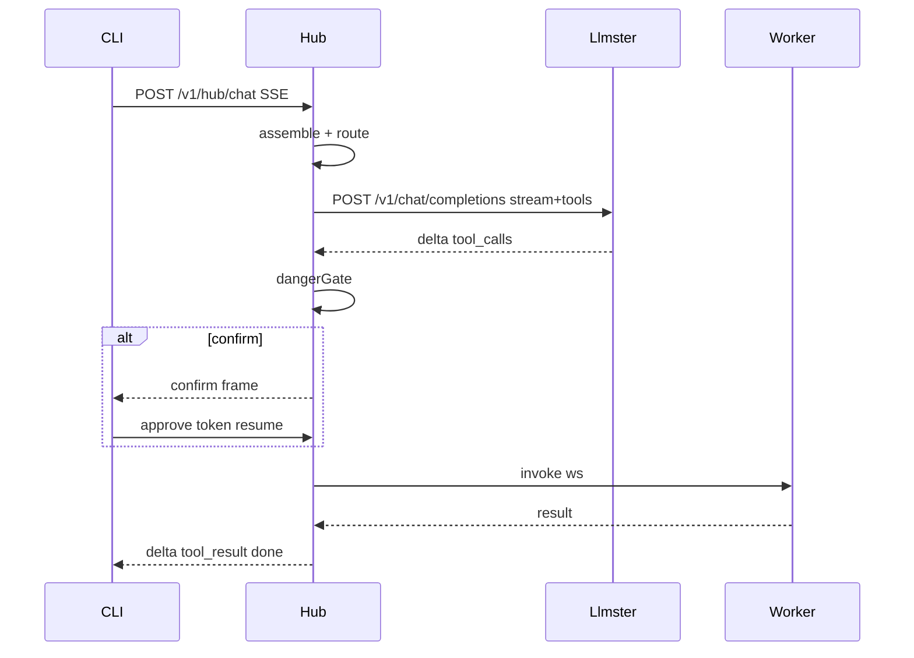

# VenGlyph 제어평면 M0+M1 구현 계획

범위: [docs/design/control-plane-implementation-plan.md](docs/design/control-plane-implementation-plan.md)의 **M0 + M1**. M2(Auto 규칙표·원격 Worker·채널·FTS5)는 하지 않는다.

한 줄 목표: **같은 workspace로 `hub chat`을 다시 열면 대화가 이어지고, 로컬 파일을 Worker가 만진다.**

## 재사용 / 고정 결정

- 위치: 이 레포 `src/server/**`, `src/worker/**`, `src/cli/**`, CLI bin `venglyph`
- Store: `node:sqlite` WAL 단일 파일 (`HUB_DB_PATH`)
- HTTP: Hono + `@hono/node-server` + `streamSSE`
- LLM: **로컬 llmster / LM Studio** OpenAI 호환 (`HUB_LLM_BASE_URL`, 기본 `http://127.0.0.1:1234/v1`) + 모델 `HUB_LLM_MODEL` (기본 `qwen/qwen3.5-9b`). 네이티브 `tool_calls` 사용. 1min/`one-min-mcp`는 M1 비범위
- Worker 링크: 아웃바운드 WebSocket only — 의존성 `ws` 추가, 서버는 upgrade 핸들러로 `/v1/hub/worker` 연결 (Hono fetch와 병행)
- FA: `HUB_FA`는 `confirm`만 자동 승인, `deny`는 불가

## Phase M0 — 골격 + 게이트

산출물:

| 경로 | 역할 |
| --- | --- |
| `src/server/schema.ts` | records / messages / links DDL |
| `src/server/store.ts` | `node:sqlite` open, migrate, health |
| `src/server/app.ts` | Hono app, `GET /v1/hub/healthz` |
| `src/server/dangerGate.ts` + `.test.ts` | allow / confirm / deny |
| `src/cli.ts` / `src/cli/` | 서버 기동 · `hub` 서브커맨드 stub |
| `.env.example` + README | `HUB_DB_PATH`, `HUB_PORT`, `HUB_WORKER_TOKEN`, `HUB_FA`, `HUB_LLM_BASE_URL`, `HUB_LLM_MODEL` |
| `package.json` | `dev:hub`, test 경로에 dangerGate 추가 |

수용: `pnpm dev:hub` → healthz 200, DB 파일 생성, `pnpm test`로 gate 통과.

커밋 단위 예: `chore:` env/scripts → `feat:` store+healthz → `feat:` dangerGate+test → CLI wiring.

## Phase M1 — SSOT + Worker + CLI

### 1. 공유 프로토콜

[`src/shared/protocol.ts`](src/shared/protocol.ts): zod로 WS 프레임 (`hello`/`ready`/`invoke`/`result`/`progress`/`ping`/`pong`) + SSE 이벤트 타입. 서버·Worker가 동일 import.

### 2. HTTP 라우트 (`/v1/hub`)

- `POST /sessions` — `(workspace, channel)` upsert, `resumed`
- `GET /sessions/:id/messages?after=`
- `POST /chat` — SSE: `delta` · `tool_call` · `tool_result` · `confirm` · `done`
- `GET /records?type=&q=&limit=` — LIKE 스텁
- `GET /workers` — online registry

### 3. 오케스트레이션

- `assemble.ts` — 현재 세션 turns + LIKE 결과, 토큰 예산 초과 시 오래된 턴부터 truncate
- `route.ts` — Auto 스텁: 기본 `HUB_LLM_MODEL` (`qwen/qwen3.5-9b`), `code` 힌트면 같은 로컬 엔드포인트의 code용 모델 id(환경변수, 없으면 기본과 동일)
- `llm.ts` — OpenAI 호환 `chat.completions` 스트림 클라이언트 (`fetch`), `tools` + 네이티브 `tool_calls` 파싱
- `dispatch.ts` — parse tool_calls → dangerGate → Worker invoke → `role:tool` append → 루프 (confirm은 SSE로 막고 재개)

### 4. Worker

`src/worker/{index,ws,tools,sandbox}.ts`:

- 아웃바운드 `ws` → hub, `hello`에 token/workspace/tools
- 툴 3개: `fs.read` / `fs.write` / `shell.exec`
- `sandbox.ts`: 경로 normalize 후 workspace prefix 밖이면 거부
- 15s ping/pong, 실패 시 서버가 offline

### 5. CLI

`hub chat` / `hub worker`:

- `--workspace` 기본 cwd
- SSE 소비, `confirm` 시 y/n
- Worker는 별도 프로세스: `hub worker --workspace …`

## 수용 기준 (완료 정의)

전제: llmster/`lms server`가 `HUB_LLM_BASE_URL`에서 응답하고, 대상 모델이 load되어 있을 것.

1. `hub worker --workspace <dir>` → `GET /workers` online
2. `hub chat` “README 첫 줄” → `fs.read` 반영
3. “파일 하나 만들어” → confirm → 로컬 생성
4. 같은 workspace 재실행 → `resumed: true`, 이전 턴 포함
5. `rm -rf /` → deny, Worker에 invoke 없음

## 명시적 비범위

- Knowledge ingest, embedding, links 채우기, 승격 루프
- Auto 규칙표 본문, 원격 Worker, 웹/TG 채널, FTS5
- Pi 임베드
- 1min / `one-min-mcp` 프로바이더 (후속 멀티프로바이더에서)

## 리스크 대응 (계획서 6장)

- llmster 미기동·모델 unload → healthz/chat가 명확한 에러; 수용 전 `GET /v1/models`로 사전 확인
- 로컬 모델 tool_calls 품질 편차 → schema를 엄격히 두고, 파싱 실패 시 세션에 기록 후 사용자에게 재시도 유도
- WS upgrade 난항 시 → 같은 zod 계약으로 롱폴 `GET /worker/next` + `POST /worker/result`로 대체 (계약 유지, 구현만 교체)

## AGENT.md 준수

의미 단위마다 즉시 커밋 (영문 conventional). `src/**` 변경 시 `pnpm typecheck` (+ 해당 테스트) 통과 후 커밋. 브랜치: `feat/control-plane` (main 직커밋 금지).
